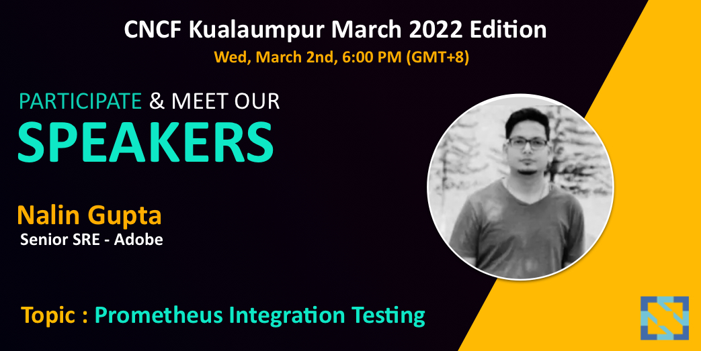

# Community Builder/CNCF Speaker/SRE

## CNCF - Prometheus-integration-testing

CNCF - Kuala Lumpur talk on Prometheus Monitoring & integration testing that should be part of your CI/CD.

## Kubectl workshop

Reference:
![alt text][logo]

[logo]: https://github.com/adam-p/markdown-here/raw/master/src/common/images/icon48.png ""

[Namespaces, Pods, Deployment, Scale, Secret, troubleshooting](https://github.com/nalinkantgupta/kubectl-workshop#k8-cli-workshop)

  <i>Let's connect and chat! Open to anything under the sun.</i>

  

    
    
  

  

    
  

  

    
  

  

    
  

